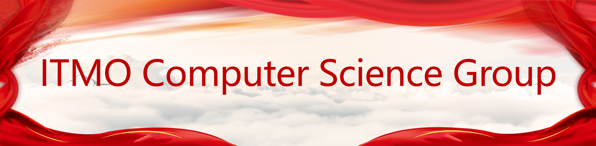

# ITMO-Computer-Science-Group

### 介绍

这个项目有迹可考于2020年11月21日开始。我们是由教育部留学基金委派出至ITMO大学计算机类专业的学生，[@染樱](https://www.github.com/Ran-ying) 是这个项目的第一组织与维护者。

以下是这个项目的组成和维护者：

### Introduction

This project started at 2020/11/21. We are university students from CSC (China Scholarship Council) studying in university ITMO. [@Ran-ying](https://www.github.com/Ran-ying) is the chief maintainer of this project. 

Here is this project's Composition and Maintainers:

### референция

### 基本价值观

- 无审查传播言论自由 —— 在这个项目中每个人都有传播自己的言论和思想的自由，而不必遭到任何人的阻止。
- 在公共领域进行交流 —— 在这个项目中所有有价值的东西，例如对技术的讨论，我们建议将其公开到 `issue` 或者 `群聊` 中。
- 互相交流，信息流通 —— 通过及时地互相交流，促进信息的自由流通和项目状态的透明。
- 知识共享，共同进步 —— 我们建议将任何有价值的东西在公共领域（例如 `issue` 或者 `群聊`）进行共享，以达到共同进步的目的。
- 接纳异己的思想意见 —— 面对与自己不同的方法论时，请与其讨论并相互吸纳改进。
- 保持维护创造的热情 —— 每个人都有权利将这个项目向前推进，而不必拘泥于当前的做法或文档。
- 平等公正，信息公开 —— 在项目中每个人都是平等的，并且权责相符，项目中的每个决策和行为都能做到公开。
- 与时俱进，开拓创新 —— 及时跟随项目的技术栈，并认真研究学习，在技术前沿我们的技术栈是不断变化的。

### Composition

- [Russian Language Studying](https://itmo-computer-science-group.github.io/Russian-Language-Studying/)  
- [Preparatory Courses](https://itmo-computer-science-group.github.io/Preparatory-Courses/)
- [Our GitHub](https://github.com/ITMO-Computer-Science-Group/)
- [Our Website](https://itmo.ranying.xyz/)

### Maintainers

- [Ran-ying](https://github.com/Ran-ying)(admin)  
- [Tolia-GH](https://github.com/Tolia-GH)(admin)  
- [GreatTyron](https://github.com/GreatTyron)  
- [D-benlala](https://github.com/D-benlala)  
